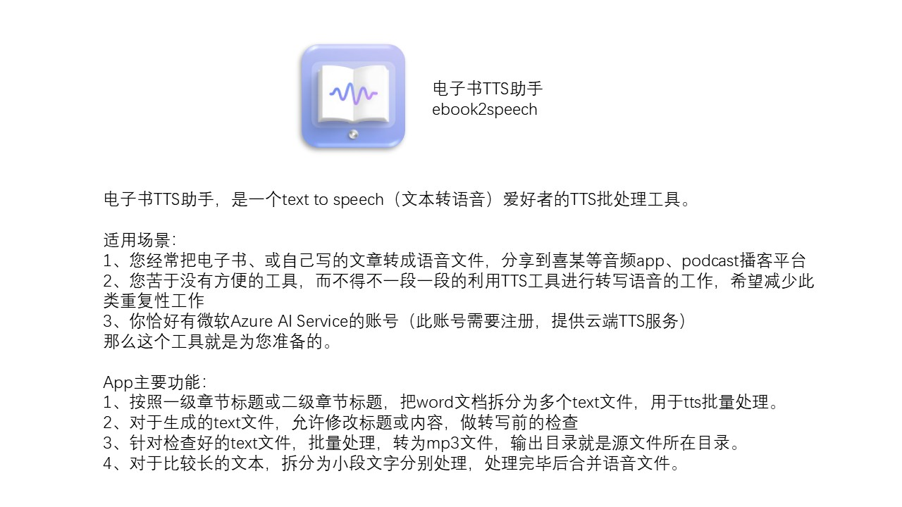

# ebook2speech
电子书TTS助手，是一个text to speech（文本转语音）爱好者的TTS批处理工具。

适用场景：
1、您经常把电子书、或自己写的文章转成语音文件，分享到喜某等音频app、podcast播客平台
2、您苦于没有方便的工具，而不得不一段一段的利用TTS工具进行转写语音的工作，希望减少此类重复性工作
3、你恰好有微软Azure AI Service的账号（此账号需要注册，提供云端TTS服务）
那么这个工具就是为您准备的。

App主要功能：
1、按照一级章节标题或二级章节标题，把word文档拆分为多个text文件，用于tts批量处理。
2、对于生成的text文件，允许修改标题或内容，做转写前的检查
3、针对检查好的text文件，批量处理，转为mp3文件，输出目录就是源文件所在目录。
4、对于比较长的文本，拆分为小段文字分别处理，处理完毕后合并语音文件。

隐私说明
本软件尊重并保护所有使用服务用户的个人隐私权。本软件不会收集您的个人信息，也不会存储和向第三方提供您的个人信息。本软件会不时更新本隐私权政策。您在同意本软件服务使用协议之时，即视为您已经同意本隐私权政策全部内容。本隐私权政策属于本软件服务使用协议不可分割的一部分。
1.适用范围
a)在您使用本软件期间，本软件不会收集您的个人信息，本软件也不具备联网访问其他网站信息的功能，所以请放心使用本软件。
2.信息披露
a)本软件不会收集也不会将您的信息披露给不受信任的第三方。
3.信息存储和交换
本软件不会收集也不会存储您的个人信息。
